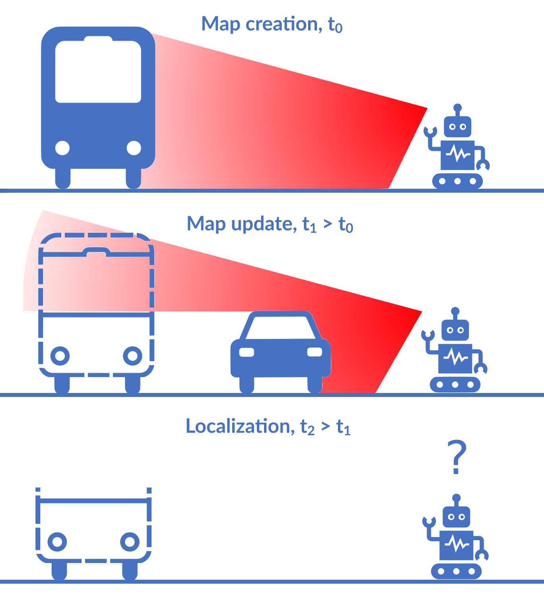
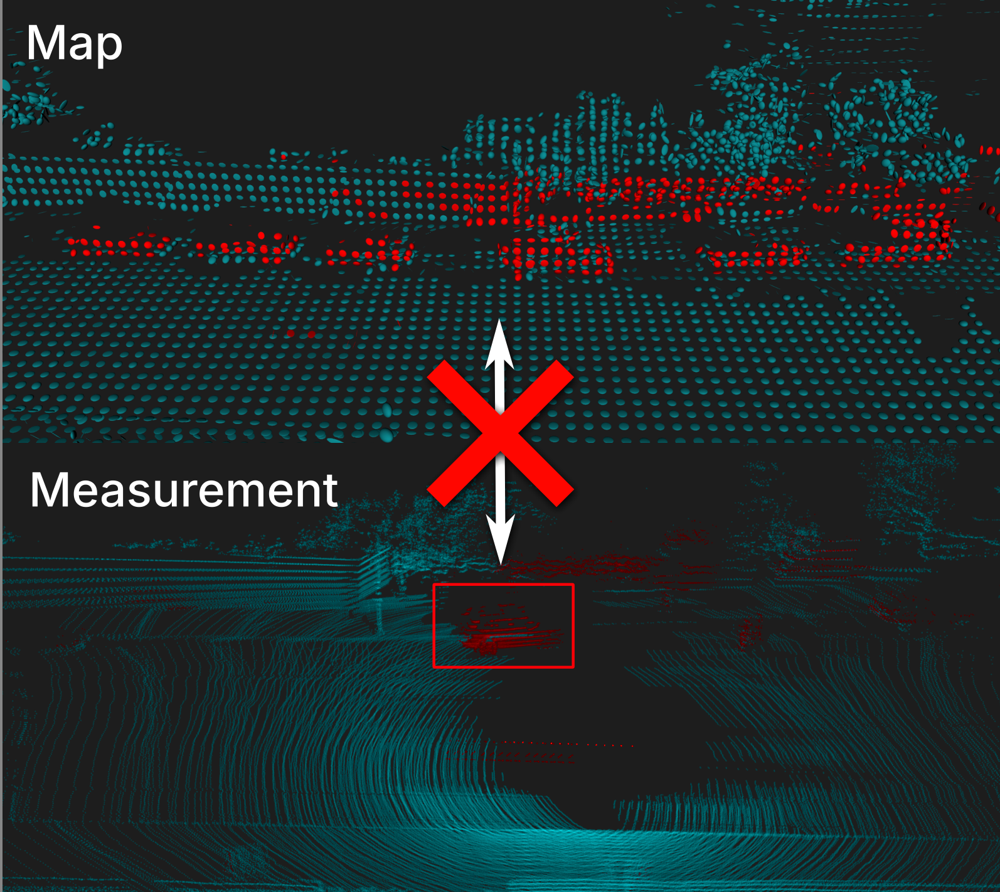

something else here

# Do visual language maps capture latent semantics?

[ArXiv](https://arxiv.org/abs/2403.10117).

Visual-language models (VLMs) have recently been introduced in robotic mapping by using the latent representations, i.e, embeddings, of the VLMs to represent the natural language semantics in the map. The main benefit is moving beyond a small set of human-created labels toward open-vocabulary scene understanding. While there is anecdotal evidence that maps built this way support downstream tasks, such as navigation, rigorous analysis of the quality of the maps using these embeddings is lacking. We investigate two critical properties of map quality: queryability and consistency. The evaluation of queryability addresses the ability to retrieve information from the embeddings. We investigate two aspects of consistency: intra-map consistency and inter-map consistency. Intra-map consistency captures the ability of the embeddings to represent abstract semantic classes, and inter-map consistency captures the generalization properties of the representation. In this paper, we propose a way to analyze the quality of maps created using VLMs, which forms an open-source benchmark to be used when proposing new open-vocabulary map representations. We demonstrate the benchmark by evaluating the maps created by two state-of-the-art methods, VLMaps and OpenScene, using two encoders, LSeg and OpenSeg, using real-world data from the Matterport3D data set. We find that OpenScene outperforms VLMaps with both encoders, and LSeg outperforms OpenSeg with both methods.

# Object-oriented grid mapping in dynamic environments

[ArXiv](https://arxiv.org/abs/2309.08324).

Grid maps, especially occupancy grid maps, are ubiquitous in many mobile robot applications. To simplify the process of learning the map, grid maps subdivide the world into a grid of cells whose occupancies are independently estimated using only measurements in the perceptual field of the particular cell. However, the world consists of objects that span multiple cells, which means that measurements falling onto a cell provide evidence of the occupancy of other cells belonging to the same object. Current models do not capture this correlation and, therefore, do not use all available data for estimating the state of the environment.
In this work, we present a way to generalize the update of grid maps, relaxing the assumption of independence by modeling the relationship between the measurements and the occupancy of each cell as a set of latent variables and jointly estimating those variables and the posterior of the map.
We propose a method to estimate the latent variables by clustering based on semantic labels and an extension to the Normal Distributions Transfer Occupancy Map (NDT-OM) to facilitate the proposed map update method. We perform comprehensive map creation and localization experiments with real-world \dataset{}s and show that the proposed method creates better maps in highly dynamic environments compared to state-of-the-art methods. Finally, we demonstrate the ability of the proposed method to remove occluded objects from the map in a lifelong map update scenario.

# Localization under consistent assumptions over dynamics

[ArXiv](https://arxiv.org/abs/2305.16702).

Accurate maps are a prerequisite for virtually all mobile robot tasks. Most state-of-the-art maps assume a static world; therefore, dynamic objects are filtered out of the measurements. However, this division ignores movable but non-moving---i.e, semi-static---objects, which are usually recorded in the map and treated as static objects, violating the static world assumption and causing errors in the localization. This paper presents a method for consistently modeling moving and movable objects to match the map and measurements. This reduces the error resulting from inconsistent categorization and treatment of non-static measurements. A semantic segmentation network is used to categorize the measurements into static and semi-static classes, and a background subtraction filter is used to remove dynamic measurements. Finally, we show that consistent assumptions over dynamics improve localization accuracy when compared against a state-of-the-art baseline solution using real-world data from the Oxford Radar RobotCar data set.